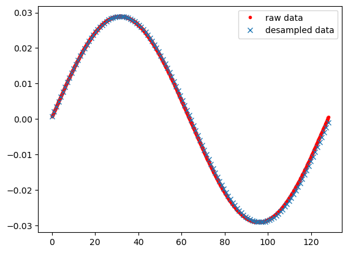
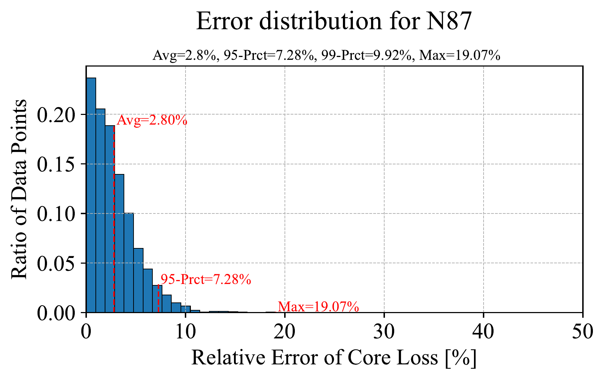

# MagLearn Documentation

This pipeline is designed to work with data in the format of the MagNet dataset. For the exact format of material datasets, see example_material. For this model in particular, datasets required for each material must include:

- B waveform time series data, recommended sample rate of at least 128 samples per wave period.
- Fundamental waveform frequency
- Temperature at material surface
- Empirically measured volumetric power loss

The overall model provides a sequence-to-scalar prediction of volumetric power loss based on a flux timeseries with temperature and frequency scalars. Therefore, the H field timeseries included in the MagNet dataset is not required.

## Pipeline Stages

The pipeline is broken into 3 stages:

1. **Data preprocessing**
2. **Training stage**
3. **Model verification stage**

## Directory Structure

The entire pipeline works on three key directories:

- **Working directory**: where the Jupyter notebooks and Python files are kept and executed from.
- **raw_data_path**: The raw data directory housing the unprocessed unzipped MagNet dataset, referenced by `batch_pre_process.ipynb`.
- **data_dir**: The output data directory that will store the processed training data, as well as the trained model and validation plot for each material, referenced by all notebooks.

This absolute path structure is designed to accommodate large datasets that could be stored on separate drives or on Google Drive if running on Google Colab, allowing the working directory to remain lightweight. For simplicity, when using small datasets these two data directories could also be stored within the working directory.

## Data Preprocessing

This stage is covered by the `batch_pre_process.ipynb` script. It accepts any number of training materials in the following directory format:

```
raw_data_path >
    Material_0
        B_waveform[T].csv
        Frequency[Hz].csv
        Temperature[C].csv
        Volumetric_losses[Wm-3].csv
    ...
    Material_N
```
For each material:

- The script uses `maglib.py` to import the raw data to the workspace. `dataTransform()` then resamples the H timeseries to 128 samples and standardizes the temperature, volumetric losses, and H timeseries to the minimum and maximum values of the entire material training dataset. This means that each sample H timeseries is not normalized to the minimum and maximum within that time series but to the global minimum and maximum points of all sampled timeseries for the material. This standardized data is then combined and exported as `data_processed.mat` into the directory specified by `{data_dir}/’Processed Training Data’/{Material}/` along with the scaling factors used for the standardizations, which will be referenced later in the training and validation pipelines. These scaling factors are saved as four `.STDD` files corresponding to each datatype.



- Next, `dataSplit()` will randomly split the same standardized data into training, validation, and testing sets for the training pipeline in a default respective 70:20:10 ratio. To use a custom ratio, simply define them in `batch_pre_process.ipynb` as a 3-element vector passed into a third argument when calling `dataSplit()`. `dataSplit()` then exports these 3 randomly split datasets as `.mat` data files into the same directory used for `data_processed.mat`.

## Training Pipeline

This stage is covered by the `batch_training.ipynb` notebook and is where all bulk training occurs. This is designed to work almost seamlessly on both Google Colab or locally using CUDA-compatible GPU acceleration if present. A few things to note for each option:

### Google Colab:

- Upload the working code directory containing `batch_training.ipynb` and the Python support code to a folder in Google Drive. Then upload the previously mentioned data directory to its own folder in Drive.
- The simplest way to run `batch_training.ipynb` is to right-click on the script in the code folder of Drive and select ‘Open in Google Colaboratory’. With the notebook now open, set `data_dir` to the Drive file path of the data directory you have just uploaded, usually the path starts with ‘MyDrive/…’. Next, set the `working_dir` to point to the working code directory you have just uploaded to Drive, also normally beginning with ‘MyDrive/…’.
- To run the script, ensure you have first initiated a runtime with GPU acceleration.

### Local Compute

- To take advantage of hardware acceleration, ensure your device has a CUDA-compatible GPU.
- If this is your first time using Pytorch with CUDA, ensure Pytorch has the necessary CUDA packages by installing a fresh Pytorch build from [here](https://pytorch.org/get-started/locally/) with the Compute Platform set to CUDA.
- Now run the notebook, ensuring the CUDA GPU is recognized after executing the CUDA cell.
- If your GPU is limited on memory, consider reducing the `valid_batch_size` in the Model Training cell.

At this stage, the standardization parameters associated with each material dataset are embedded into the `.ckpt` file for use in model inference from unstandardized data.

## Options for Transfer Learning

The Model Training cell contains various options to consider which affect training:

- The base model transfer learning option described in the paper can be disabled by setting the `base_mat` value to empty ‘’. This will cause each material to train from scratch, i.e., with no initial weightings. If you wish to use the transfer learning feature, you can specify the material trained first and used as a base for the rest of the materials by specifying it in the `base_mat` variable. By default, it is recommended to select the material with the largest training dataset, although there is great scope for investigation here. The trained weightings for each material are stored in respective `{material}.ckpt` files within the ‘Trained Weights’ subfolder in the Data Directory.
- Next, the epochs and valid batch size used for training can be tweaked. With enough GPU memory, larger batch sizes enable faster training although this is known to lead to overfitting if not carefully considered.

## Verification Pipeline

This stage is covered by the `batch_verify.ipynb` notebook. This program verifies the accuracy of the previously trained model weights by using it to infer loss from previously unseen ‘verification’ datasets and comparing it to the actual losses of that dataset. `batch_verify.ipynb` uses `MagLoss()` from `MagNet.py` to infer losses from the `valid.mat` data.

This verification dataset was separated from the testing and training samples in the data splitting stage of the preprocessing pipeline. By default, this will use a maximum of 2000 samples from the validation dataset to prevent excessive computation time. This number can be increased by changing `max_samples` if using larger datasets. For example, the raw MagNet dataset for material 3C90 contains 40713 independent measurements of core loss with corresponding B timeseries, temperature, and frequency. Under a 70:20:10 train-validate-test splitting regime, the validation dataset would contain 8143 samples which would be capped to 2000. Note the specific samples of the 8143 that get truncated under this scenario would have a negligible effect on the results as the order of the samples was randomized in the original splitting stage.

The distribution in the absolute error between predicted and actual core losses for each sample is then plotted using `Mag_plot()` from `MagNet.py` and key measures of spread are calculated. An example error distribution for N87 is seen in Figure 1 below showing the mean, 95 percentile, 99 percentile, and maximum error from the verification dataset.



The script also compiles and exports a summary of mean, 95, and 99 percentile errors for all the materials being validated in the directory. This summary is exported as `model_errors.csv` in the ‘{data_dir}/Validation’ space next to the error histograms for each material.

## Model Deployment

Once the model is validated it can be deployed using the `MagNet.MagLoss_shiftflip()` function to predict core loss densities from the model checkpoint, a B waveform, temperature, and waveform frequency. It uses the standardization parameters embedded into the checkpoint file during the training stage avoiding the need for `.stdd` files when deploying the trained model.

Using `MagNet.MagLoss_shiftflip()` is recommended over directly calling `MagNet.MagLoss()` as it will repeat the inference `test_num` number of times where each inference calls `MagLoss()` to randomly shift and flip the B waveform making it more robust to phase shifted input data. By default, this is done 100 times for each call of `MagLoss_shiftflip()`.

`deploy.ipynb` contains the most simplified and easy to use deployment script which handles importing a waveform timeseries from a csv along with the setting of temperature and frequency.
